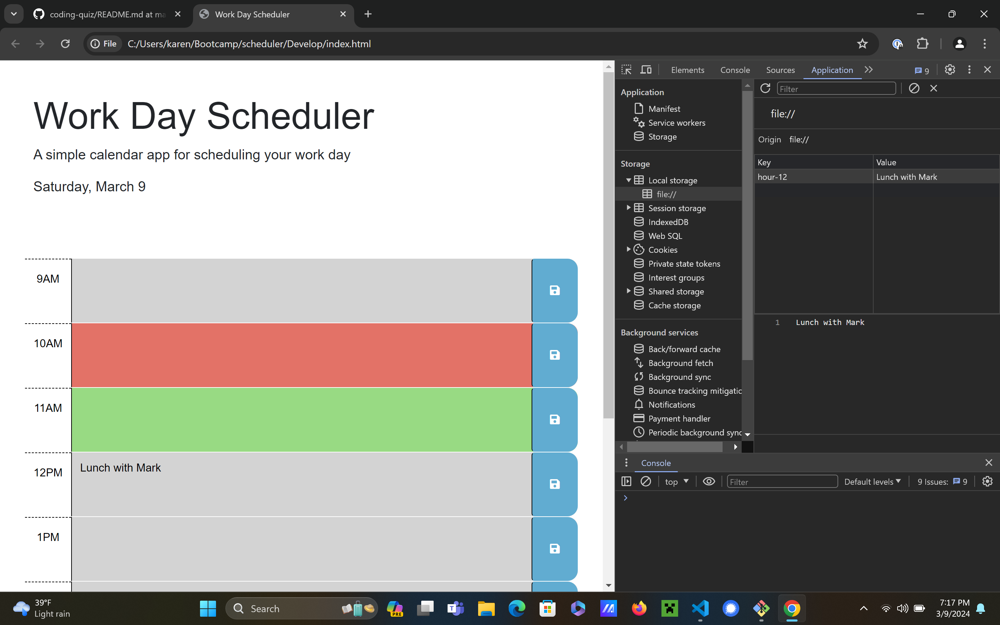

# Work Day Scheduler Starter Code

UConn Bootcamp Work Day Scheduler

https://github.com/khionewi/scheduler.git

Challenge 5 - Khionewi - Dr. Karen Fioravanti

Description The What: The object is to create a practical work day scheduler

The Why: The purpose of this project is to create a work day scheduler. The user has the option to add events to different hours of the day. Hours are color=coded to represent past, present, and future. This is an assignment for UCONN Coding Bootcamp. It uses GitHub, code reviews, HTML, CSS, jQuery, web APIs and Javascript (as of 3/11/2024). 

The How: The assignment relies on our knowledge of HTML, CSS, Javascript, web APIs, jQuery and GitHub.

Installation No local installation is required for this project. It can be viewed locally in the default browser. It is formatted for desktop viewing; however the screen is adaptable to accomadate mobile devices.

Usage This project was used for the Week 4 challenge for UCONN Coding Bootcamp, Jan 2024 term.

Credits I relied on knowledge from previous coursework (I hold a certificate in HTML/CSS from Anne Arundel Community College which included basic javascript) as well as the coursework for the UCONN bootcamp weeks 1 -4.

The following websites were referenced:
UConn Bootcamp weekly homework

License The MIT license was used for this project.

Features This website showcases practical work day scheduler that can stored events locally that persist upon refresh.